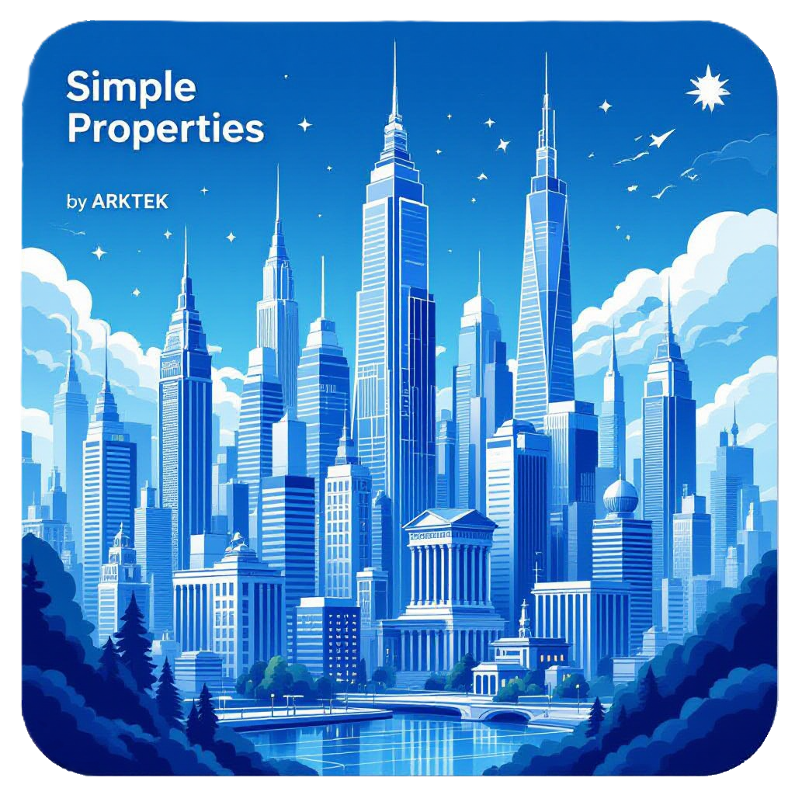

# Simple Properties - AI-Powered Property Management App

<div align="center">



**A comprehensive property management solution powered by AI for real estate investors and property managers**

[](https://reactnative.dev/)
[](https://expo.dev/)
[](https://www.typescriptlang.org/)
[](LICENSE)

</div>

## 🏠 Overview

Simple Properties is a cutting-edge mobile property management application that combines traditional property management features with AI-powered insights and document generation. Built with React Native and Expo, it provides real estate investors and property managers with comprehensive tools to manage their portfolio efficiently.

### Key Capabilities

- **AI-Powered Document Generation**: Automated creation of leases, rental applications, eviction notices, and other legal documents
- **Investment Portfolio Analysis**: Real-time financial analytics, ROI calculations, and market comparisons
- **Predictive Maintenance**: AI-driven maintenance scheduling and cost predictions
- **Tenant Management**: Complete tenant lifecycle management with digital applications and communications
- **Market Intelligence**: Integration with local market data for informed investment decisions
- **Mobile-First Design**: Native mobile experience optimized for on-the-go property management

## ✨ Features

### 📋 Property Management
- **Property Portfolio Dashboard**: Visual overview of all properties with key metrics
- **Cash Flow Analysis**: Real-time income, expense, and profitability tracking
- **Property Details**: Comprehensive property information including photos, documents, and history
- **Maintenance Tracking**: Schedule, track, and predict maintenance needs

### 🤖 AI-Powered Features
- **Document Generation**: Create professional property management documents using AI
- **Investment Advisor**: Get AI-powered investment recommendations and market insights
- **Maintenance Predictions**: Predict future maintenance needs and costs
- **Portfolio Analysis**: Advanced analytics with risk assessment and diversification metrics

### 📄 Document Templates
- Lease Agreements (20-30 customizable fields)
- Rental Applications (15-20 fields)
- Tenant Notices (5-10 fields)
- Eviction Notices (15-25 fields)
- Inspection Checklists (10-15 fields)
- Welcome Letters (3-5 fields)
- Policy Change Notices (5-10 fields)

### 👥 Tenant Management
- **Digital Applications**: Streamlined tenant application process
- **Communication Hub**: Centralized tenant communications
- **Lease Management**: Digital lease creation, signing, and renewals
- **Payment Tracking**: Monitor rent payments and late fees

### 📊 Analytics & Reporting
- **Financial Dashboards**: ROI, cap rates, cash-on-cash returns
- **Market Analysis**: Compare properties against local market data
- **Performance Metrics**: Track property performance over time
- **Investment Insights**: AI-generated recommendations for portfolio optimization

## 🛠 Technology Stack

### Mobile App
- **Framework**: React Native 0.79.5 with Expo 53.0.22
- **Language**: TypeScript
- **UI Components**: React Native Paper
- **State Management**: Zustand + React Context
- **Navigation**: Expo Router
- **Storage**: AsyncStorage
- **AI Integration**: ONNX Runtime for on-device ML

### Backend Services
- **Gateway**: Node.js API gateway with AI integration
- **AI Engine**: Ollama with Qwen2.5-0.5B-Instruct model
- **Document Processing**: DOCX generation and HTML conversion
- **Deployment**: Kubernetes with Docker containers

### Data & Analytics
- **Market Data Service**: Regional market analysis (North Dakota focus)
- **Portfolio Analytics**: Advanced financial calculations and risk assessment
- **Document Templates**: Comprehensive property management document library

## 🚀 Quick Start

### Prerequisites
- Node.js 18+ and npm/yarn
- Expo CLI: `npm install -g @expo/cli`
- React Native development environment
- iOS Simulator or Android Emulator (for development)

### Mobile App Setup

1. **Clone the repository**
   ```bash
   git clone https://github.com/sethtillotson/rork-simple-properties.git
   cd rork-simple-properties
   ```

2. **Install dependencies**
   ```bash
   npm install
   # or
   yarn install
   ```

3. **Start the development server**
   ```bash
   npm start
   # or
   yarn start
   ```

4. **Run on device/simulator**
   ```bash
   # iOS
   npm run ios
   
   # Android
   npm run android
   
   # Web
   npm run start-web
   ```

### Gateway Services Setup

The app integrates with AI gateway services for advanced features:

1. **Navigate to gateway directory**
   ```bash
   cd gateway
   npm install
   ```

2. **Start the gateway service**
   ```bash
   node server.js
   ```

3. **Deploy with Kubernetes** (optional)
   ```bash
   kubectl apply -f k8s.yaml
   kubectl apply -f ollama.yaml
   ```

## 📱 Usage Guide

### Getting Started
1. **Launch the app** and complete the initial setup
2. **Add your first property** using the Properties tab
3. **Configure property details** including financial information
4. **Generate documents** using the AI-powered document generator
5. **Track maintenance** and financial performance

### Document Generation
1. Navigate to any property
2. Select "Generate Document"
3. Choose from available templates
4. AI automatically fills relevant property information
5. Review and export as PDF or DOCX

### Investment Analysis
1. Access the Investment Advisor from the main menu
2. Review AI-generated portfolio insights
3. Explore market comparisons and recommendations
4. Track ROI and cash flow metrics

### Maintenance Management
1. Use the Maintenance tab to schedule tasks
2. AI predicts optimal timing based on property age and history
3. Track costs and generate reports
4. Set up automated reminders

## 🏗 Architecture

### Mobile App Structure
```
├── app/                    # Expo Router pages
├── components/             # Reusable UI components
├── context/               # React Context providers
├── hooks/                 # Custom React hooks
├── services/              # API and data services
├── types/                 # TypeScript type definitions
├── utils/                 # Utility functions
└── assets/                # Images, icons, and static files
```

### Gateway Architecture
```
├── gateway/               # AI gateway service
│   ├── server.js         # Main gateway server
│   ├── k8s.yaml          # Kubernetes deployment
│   └── ollama.yaml       # Ollama LLM service
└── gateway-converter/     # Document conversion service
```

### Key Services

- **PropertyService**: Property CRUD operations and calculations
- **DocumentService**: Template management and AI generation
- **AnalyticsService**: Financial calculations and market data
- **MaintenanceService**: Predictive maintenance algorithms
- **MarketDataService**: Regional market intelligence

## 🔧 API Reference

### Gateway Endpoints

| Endpoint | Method | Description |
|----------|--------|-------------|
| `/health` | GET | Health check |
| `/api/ping` | GET | API availability |
| `/api/generate` | POST | AI document generation |
| `/api/analyze-portfolio` | POST | Portfolio analysis |
| `/api/predict-maintenance` | POST | Maintenance predictions |
| `/convert/docx` | POST | HTML to DOCX conversion |

### Example API Usage

```javascript
// Generate a document
const response = await fetch('http://your-gateway:8082/api/generate', {
  method: 'POST',
  headers: { 'Content-Type': 'application/json' },
  body: JSON.stringify({
    template: 'lease-agreement',
    variables: { property_address: '123 Main St', monthly_rent: 1200 }
  })
});

// Analyze portfolio
const analysis = await fetch('http://your-gateway:8082/api/analyze-portfolio', {
  method: 'POST',
  headers: { 'Content-Type': 'application/json' },
  body: JSON.stringify({
    properties: [/* property objects */]
  })
});
```

## 🧪 Development

### Running Tests
```bash
npm test
```

### Code Style
The project uses ESLint and Prettier for code formatting:
```bash
npm run lint
npm run format
```

### Building for Production
```bash
# Build the app
expo build:android
expo build:ios

# Build gateway service
cd gateway
npm run build
```

### Environment Variables
Create a `.env` file in the root directory:
```env
EXPO_PUBLIC_GATEWAY_URL=http://your-gateway:8082
EXPO_PUBLIC_OLLAMA_URL=http://your-ollama:11434
```

## 🤝 Contributing

We welcome contributions! Please see our [Contributing Guidelines](CONTRIBUTING.md) for details.

### Development Workflow
1. Fork the repository
2. Create a feature branch: `git checkout -b feature/amazing-feature`
3. Make your changes and test thoroughly
4. Commit your changes: `git commit -m 'Add amazing feature'`
5. Push to the branch: `git push origin feature/amazing-feature`
6. Open a Pull Request

### Code Guidelines
- Follow TypeScript best practices
- Use React Native Paper components for UI consistency
- Write tests for new features
- Update documentation as needed

## 📄 License

This project is licensed under the MIT License - see the [LICENSE](LICENSE) file for details.

## 🙏 Acknowledgments

- **Ollama** for providing the local LLM infrastructure
- **Expo** and **React Native** communities for excellent mobile development tools
- **React Native Paper** for beautiful Material Design components
- **ONNX Runtime** for efficient on-device ML inference

## 📞 Support

- **Issues**: [GitHub Issues](https://github.com/sethtillotson/rork-simple-properties/issues)
- **Documentation**: Check the `/docs` folder for detailed guides
- **Community**: Join our discussions in GitHub Discussions

## 🗺 Roadmap

### Upcoming Features
- [ ] Multi-language support
- [ ] Advanced reporting and exports
- [ ] Integration with accounting software
- [ ] Tenant portal mobile app
- [ ] IoT device integration for smart properties
- [ ] Machine learning model improvements

### Recent Updates
- ✅ Enhanced AI prompts for better document generation
- ✅ Market data integration for North Dakota regions
- ✅ Advanced portfolio analytics
- ✅ Kubernetes deployment support
- ✅ DOCX export functionality

---

<div align="center">

**Made with ❤️ for Real Estate Professionals**

[Website](https://rork.com) • [Documentation](./docs) • [Issues](https://github.com/sethtillotson/rork-simple-properties/issues) • [Discussions](https://github.com/sethtillotson/rork-simple-properties/discussions)

</div>